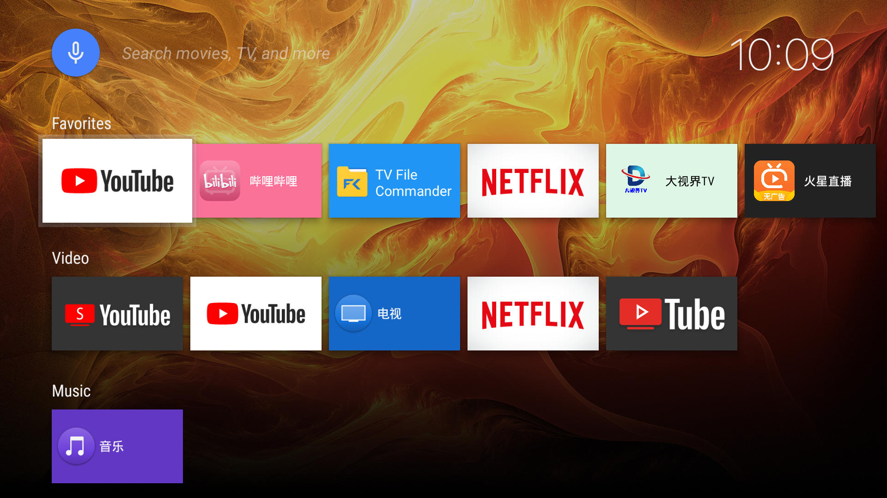
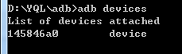
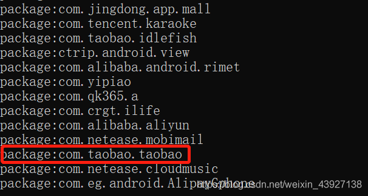

# sony 电视

2022\-2\-18

XR\-65X91J 65英寸 LED显示 超高清4k 首年只换不修 实付款6799.00 

搜索关键字：HDR和杜比视界

[LeanbackOnFire\_v1\-24\-release.apk](./file/LeanbackOnFire_v1-24-release.apk)

【File Commander Manager & Cloud \- Apps on Google Play】

**【ADB安装 APK】**

2022/2/22

**【新提醒】2021年新款索尼电视替换瀑布流UI教程 妥妥干货安排上\_Sony索尼电视\_ZNDS**

[https://www.znds.com/tv\-1195687\-1\-1.html](https://www.znds.com/tv-1195687-1-1.html)

1,电视ip 192.168.50.3

2,电视开启adb调试功能：打开\[设置\]\-\[系统\]\-\[关于\]\-找到\[Android TV操作系统版本\]，连按遥控器上5下\[确认键\]打开开发者模式；

返回到\[系统\]，下拉找到\[开发者选项\]，并将\[ADB\]调试打开；

3,安卓手机或PC端打开ADB Remote Shell，输入IP地址，点击\[Connect\]（手机可以下载附件内的ADB Remote Shell，连到同一局域网进行操作。电视机【确定】；

4,安卓手机输入电视的局域网IP并进入后，直接输入：

pm disable\-user \-\-user 0 com.dangbei.TVHomeLauncher

如果你是2021年之前的索尼电视，那么需要改一改：

将com.dangbei.TVHomeLauncher替换为com.google.android.tvlauncher即可，其他的原封不动！

【wifi连接很慢】

**【ADB安装APK】**

2022/2/22

**用adb工具给智能电视安装应用（在电视没法安装应用的情况下可用）****moyu666的博客\-CSDN博客****adb安装电视应用**

[https://blog.csdn.net/moyu666/article/details/105643726](https://blog.csdn.net/moyu666/article/details/105643726)

1,手机连接电视后，打开后在cmd窗口中输入adb devices，就会出现刚才连接的设备。

2,安装路径中不要有中文，不要有中文。

安装apk：adb install “\-lrtsdg” “path\_to\_apk”

“\-lrtsdg”：

\-l：将应用安装到保护目录 /mnt/asec；

\-r：允许覆盖安装；

\-t：允许安装 AndroidManifest.xml 里 application 指定 android:testOnly=“true” 的应用；

\-s：将应用安装到 sdcard；

\-d：允许降级覆盖安装；

\-g：授予所有运行时权限；

path\_to\_apk：apk的绝对路径。

示例安装淘宝apk：adb install \-t C:data/local/tmp/taobao.apk

3,卸载：adb uninstall 包名     //包名形如com.android.testme，不包含后缀.apk

不知道自己包名的可以输入下面的查询包名，查看应用列表：

查看所有应用列表：adb shell pm list packages

查看系统应用列表：adb shell pm list packages \-s

查看第三方应用列表：adb shell pm list packages \-3：

注意：如果提示被拒绝，按最下面步骤得到root权限

其中需要注意的是：查看有com.youku.tv\-1.apk，卸载时如果输入：adb uninstall com.youku.tv\-1.apk，则会报Failure错误，正确应该输入：adb uninstallcom.youku.tv，后面的“\-1”也不用，它不是包名的一部分，而是多次重复安装时Android系统自动加上的。

和安装时一样，可以查看此软件已经被成功卸载。

卸载app 但保留数据和缓存文件

adb uninstall \-k com.baidu.searchbox

将移电脑文件传输到移动端（本地 /home/user\_name）

adb push 电脑路径 移动端路径

有时候要在电视输入一些链接或者文字，但字符太长，遥控不方便，也可以使用adb输入，命令：

adb shell input text "[https://www.xxx.com](https://www.xxx.com/)"

2022/2/22

**adb下载安装及使用****Dongs丶的博客\-CSDN博客****adb安裪*…

**【安卓TV的主屏界面】**

1,apkmirror上有Google TV Home的launcher【需要谷歌框架，无法使用】

2,ATV Launcher【不错】

3,亚马逊的Fire tV的ftvlaunchx

2022/2/18

**2021年新款索尼电视替换瀑布流UI教程 妥妥干货安排上\_Sony索尼电视\_ZNDS**

[https://www.znds.com/tv\-1195687\-1\-1.html](https://www.znds.com/tv-1195687-1-1.html)

如果你是2021年之前的索尼电视，那么需要改一改：

将com.dangbei.TVHomeLauncher替换为com.google.android.tvlauncher即可，其他的原封不动！

【感谢亚马逊的Fire tv，给没有google框架的国行机器创造了无限可能。】

%\!\(EXTRA markdown.ResourceType=, string=, string=\)

2022/2/18

**索尼瀑布流更换第三方启动器/Launcher/桌面\-x9100h上成功的 应该别的也可以用吧啊我的上帝【索尼电视吧】\_百度贴吧**

[https://tieba.baidu.com/p/7567044607](https://tieba.baidu.com/p/7567044607)

图标大小更改： Home Screen View ~ Banners Appearance ~ Banners Size 改第一项的百分比 而它下方的项目分别是边角半径（像素） 边框宽度（像素） 和颜色（可直接输入所需颜色的英文单词）

更改和重制壁纸： 设置~ Home Screen View（主屏视图） ~Default Wallpaper （默认壁纸）~Choose Wallpaper（选择壁纸）及 Reset Wallpaper（重制壁纸）

2022/2/21

**下午来装电视，如何【测屏】？【索尼电视吧】\_百度贴吧**

[https://tieba.baidu.com/p/5571790857](https://tieba.baidu.com/p/5571790857)

让师傅打开电视机工程模式，看看开机次数，是否新机。

打开工程模式的方法:插电开机后10秒，按摇控器绿色电源键进入待机状态，二秒钟后，在摇控器上依次按屏显、数字5、音量\-、绿色电源键，注意按键要连贯，按一个键松一个键（不要这几个键都同时按住不放），操作正确会开机后出现一行英文，即进入工程模式。

工程模式首页最下一行，有xxxx xxxx xxxx的数字，依次表示开机时长、开机次数、待机时长。

退出工程模式的方法:按绿色电源键关机后，拔下电源插头，然后再插入插头，再按绿色电源键开机，电视进入正常开机状态。

2022/2/21

**如何：在几乎所有Android电视上获得新的Google TV界面\-Nvidia Shield，Mi Box，Sony等 – 0x资讯**

[https://0xzx.com/202010050017863842.html/amp](https://0xzx.com/202010050017863842.html/amp)

2022/2/21

**索尼电视第三方桌面安装指南****软件应用****什么值得买**

[https://post.smzdm.com/p/axl325l3/](https://post.smzdm.com/p/axl325l3/)

有个缺点是偶尔开机，会重新提示询问选取哪一款桌面应用。

ADB命令框内输入指令pm disable\-user \-\-user 0 com.dangbei.TVHomeLauncher。不做这一步也没什么问题，就是偶尔开机会麻烦了点。

greenskinmonster   132天前

索尼電視是 32 位系統，所以要下 armeabi\-v7a 的版本 apk 。

YouTube for Fire TV 1.110.0 apkmirror 上有，SmartTubeNext 也不錯，可以去廣告，連視頻裡面的推廣也能跳。索尼電視是硬體支持 Youtube HDR 解碼的，這個 ATV 和 Shield 都不支持。

另外的就是 Kodi/Plex/Bilibili，X\-Explorer 訪問 NAS 上的文件、安裝 apk 什麼的。

**【youtube】**

1,sony电视没有谷歌框架，所以官方的youtube无法使用；

2,可以使用如改版的，如smaryoutube的改版APP；【进入界面后，有很多选项，但无广告】

3,或者从Fire TV提取的版本（[https://wws.lanzoui.com/b02ofzujg](https://wws.lanzoui.com/b02ofzujg)   密码:fvar 火棒提取版，可以登录，可以4K）；YouTuBe也是可以安装并正常运行（登录需要gms，所以这里推荐索尼电视用户使用火棒178版本，高于178版本也不能用了，需要亚马逊组件支持）谷歌搜 YouTube for Fire TV APK，【YouTube for Fire TV 1.5.228.0 此版本登录闪退】【另一个版本比较好，查看一下版本，有广告】

4,或者另一种改版的，**（SmartTubeNextª* [https://smartyoutubetv.github.io/](https://smartyoutubetv.github.io/) 4K支持，在没有 Google 服务的情况下运行）

**问：什么是 SmartYouTubeTV \(SYTV\)？有什么区别？**

A: SmartYouTubeTV 是第一个 3rd 方 Android TV Youtube 客户端。它不再被维护，因为所有的开发工作现在都集中在 SmartTubeNext 上。虽然 SmartYouTubeTV 和 SmartTubeNext 都做同样的事情，但它们使用不同的方法：

SmartYouTubeTV 与最初的 YouTube TV 类似，但带有用于增强功能的插件

SmartTubeNext 是一款不依赖原始 YouTube TV 代码的原生 Android 应用

最初的 YouTube TV 应用是一个webapp。谷歌可以并且确实不断更新网络代码，因此有时会破坏 SmartYouTubeTV。我们（或您）无法阻止这种情况发生。即使不更新应用程序，这些更改也适用。由于某些更改仅适用于某些国家或随机选择的用户，因此开发人员很难调试和修复任何问题。谷歌在一次更新中可能会浪费在这个应用程序上多年的辛勤工作。

SmartTubeNext 是一个本地应用程序，可以更快地加载，更稳定，更容易维护和进一步开发。SmartTubeNext 看起来不如 SmartYouTubeTV，但这只是一个小问题。

【YouTube for Fire TV 1.5.228.0】

[https://www.apkmirror.com/wp\-content/themes/APKMirror/download.php?id=1095844](https://www.apkmirror.com/wp-content/themes/APKMirror/download.php?id=1095844)

【smart youtube】

支持 4K 视频系统。它可以在没有 Google 服务的情况下工作。专为电视屏幕设计。支持多语言搜索。

首次打开应用程序时，您可以从 四个设备/分辨率选项中进行选择：1080 Main、1080 Alt、4K Main 和 4K Alt。选择适合您的，然后您可以勾选 “记住” 复选框 以在下次打开应用程序时应用它。它还允许您  无需 Google 服务即可登录您的YouTube 帐户。

它支持高达4K 分辨率，不依赖谷歌服务，并与您的遥控器配合使用。虽然它不再被积极开发，但如果你的电视仍然兼容，它工作得很好，值得一试。

2022/2/22【官方网站，但作者已经弃用】

**SmartYouTubeTV,在电视和机顶盒上舒适地观看 YouTube 视频,下载SmartYouTubeTV的源码****GitHub****帮酷**

[https://github.com/loveoz/SmartYouTubeTV](https://github.com/loveoz/SmartYouTubeTV)

PRO Main \- PRO Alt \- LITE Main \- LITE Alt

与当前的 README 不匹配。

PRO = 4K吗？1080 = 精简版？可以肯定地说 PRO 现在意味着 Exoplayer，LITE 现在意味着 Original Youtube Player？Alt 表示您需要 XWalk 而 Main 表示已经内置的 Webview？

我们能否在应用设置中获取更多信息以使这些事实更加清晰？

【出错 smartYouTube  crosswalk download failed】

2022/2/22

**如何在 Fire TV 上观看 Youtube | 火棒安裪*…

[https://mytruemedia.com/best\-firestick\-apps/how\-to\-watch\-youtube\-on\-fire\-tv\-firestick/](https://mytruemedia.com/best-firestick-apps/how-to-watch-youtube-on-fire-tv-firestick/)

必须先安装 Crosswalk 项目服务，然后 Firestick 上的 YouTube TV 才能运行。以下分步指南将引导您完成安装此服务所需的步骤以及开始播放 YouTube 视频所需的一切。

从四个可用版本中选择 1080 版本。

如果您尚未安装 Crosswalk Project Service，则需要安装它。此时您应该会收到一条消息，提示您未找到 Crosswalk 项目服务。单击获取人行横道按钮以继续从应用商店安装。

出现提示时，单击屏幕右下角的安装按钮。

当出现提示App Installed的通知时，单击完成。

【抖音 tiktok】

【twitter】

[https://www.apkmirror.com/apk/twitter\-inc/twitter\-for\-android\-tv\-android\-tv/](https://www.apkmirror.com/apk/twitter-inc/twitter-for-android-tv-android-tv/)

**【浏览器】**

FIREFOX TV

[https://www.apkmirror.com/apk/mozilla/firefox\-android\-tv/firefox\-android\-tv\-4\-8\-release/](https://www.apkmirror.com/apk/mozilla/firefox-android-tv/firefox-android-tv-4-8-release/)

与 Firefox 浏览器一样，您会在亚马逊的 App Store 中找到 Silk 浏览器。该浏览器是由亚马逊专门为 Fire TV 和 Firestick 上的用户界面开发的，因此两者都可以很好地工作。

chrome，Silk 浏览器，Firefox 浏览器，bro TV，

【去广告】

2022/2/22

**梅林安装AdGuardHome去广告 \- 不完全教程 \- 梅林固件 \- 恩山无线论坛 \- Powered by Discuz\!**

[https://www.right.com.cn/forum/thread\-4112404\-1\-1.html](https://www.right.com.cn/forum/thread-4112404-1-1.html)

【经常阶段性失效，要在youtube学习一下】

koolproxy

2022/2/22

**转发并完善KoolProxyR rules转换成KoolProxy rules自动更新规则办法 \- 梅林固件 \- 恩山无线论坛 \- Powered by Discuz\!**

[https://www.right.com.cn/forum/thread\-799455\-1\-1.html](https://www.right.com.cn/forum/thread-799455-1-1.html)

**【奈飞NETFLIX 杜比视界】不需要google 框架**

手机 → GOOGLE 搜 netflix tv apk → [https://www.apkmirror.com/apk/netflix\-inc/netflix\-android\-tv/](https://www.apkmirror.com/apk/netflix-inc/netflix-android-tv/)  → 

Netflix \(Android TV\) 8.3.2 build 4580 → 【APK】 → 【download APK】→ 

[com.netflix.ninja\_8.3.2\_build\_4580\-4580\_minAPI22\(armeabi\-v7a\)\(nodpi\)\_apkmirror.com.apk](http://com.netflix.ninja_8.3.2_build_4580-4580_minapi22%28armeabi-v7a%29%28nodpi%29_apkmirror.com.apk/)

【Bilibili 1.6.4目前可用】

【测速】

2022/2/21

**FireTV Stick 4K的火棒ª* **GitHub \- openwrt166/firetv: Firetv**

[https://github.com/openwrt166/firetv](https://github.com/openwrt166/firetv)

出差利器. 非常迷你,比遥控器还要小,可以隐藏在电视机后面.一个随身携带的专属播放器,在酒店随手插在电视上,连上wifi,国内外视频随意播放. 梯子客户端可以装在FireTV里,在外面的时候也可以自由播放NetFlix,YouTube.

电脑上需要安装的软件: ADBLink 下载地址:

2022/8/11

**YouTube for Android TV .APK Download | Raw APK**

[https://rawapk.com/youtube\-for\-android\-tv\-apk\-download/](https://rawapk.com/youtube-for-android-tv-apk-download/)

2022/8/12

**nietulong/firetv: Firetv**

[https://github.com/nietulong/firetv](https://github.com/nietulong/firetv)

2022/8/12

**国行索尼电视SR\-55X91J更换美区索尼主板教程\+评测 \- 原创分享\(新\) \- Chiphell \- 分享与交流用户体验**

[https://www.chiphell.com/thread\-2386228\-1\-1.html](https://www.chiphell.com/thread-2386228-1-1.html)

2022/8/12

**A\-5027\-263\-A索尼主板、A5027249A、1\-010\-115\-21、BM5ST、484B、XR\-65X90J、XR\-55X90J、XR\-75X90J、XR\-50X90J、XR\-55X90CJ、XR\-65X90CJ、XR \-75X90CJ**

[https://www.tvpartstoday.com/A\-5027\-263\-A\-Sony\-Main\-Board\-A5027249A\-1\-010\-115\-p/a\-5027\-263\-a.htm](https://www.tvpartstoday.com/A-5027-263-A-Sony-Main-Board-A5027249A-1-010-115-p/a-5027-263-a.htm)

end
